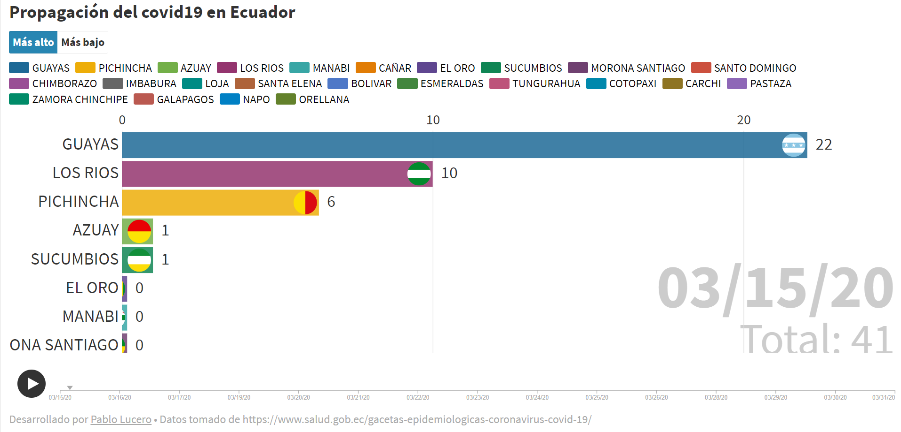

## Datos de contagios por covid19 en Ecuador
Este respositorio fue creado para recolectar los datos de los contagios por covid19 en Ecuador. Fecha de corte: 31/03/2020

La información fue obtenida desde las [gacetas] (https://www.salud.gob.ec/gacetas-epidemiologicas-coronavirus-covid-19/) oficiales del Ministerio de Salud Publica.

Estos datos fueron utilizados para crear una visualización sorprendente en [Flourih](https://public.flourish.studio/story/240030/)

  

